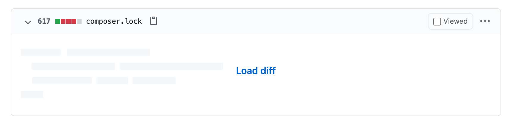
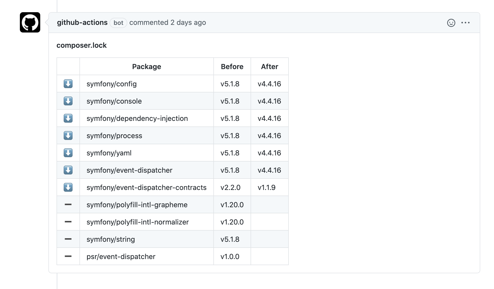

# loxcan
[](https://packagist.org/packages/siketyan/loxcan)
[](https://packagist.org/packages/siketyan/loxcan)
[](https://packagist.org/packages/siketyan/loxcan)
[](https://codecov.io/gh/siketyan/loxcan)


Universal Lock File Scanner for Git.

## 🚀 Motivation
Today, most languages have a package manager, and some language have two.
Dependency management is very important and difficult in software development.

In cases of code review, we check entire of the changed codes.
However, we often ignore lock files in the review, which controls dependencies of the project or the library.

On GitHub Pull Request, most lock files are hidden by default.



Actually, they are very long and not human-readable.

I tried to notify the diff of the lock files to the author of PR and/or the reviewer(s).
Using this action, the added, upgraded, downgraded, and removed packages are reported to the PR, in user-friendly format.



So we can check what packages will be changed by the PR, in the review.

## ✨ Usage
### Via Composer
```console
$ composer require --dev siketyan/loxcan
```

Then you can use this tool in CLI.
(In some IDEs, you can access to the executable as just `loxcan` !)

```console
$ ./vendor/bin/loxcan [base] [head]
```

### In GitHub Actions
Use `pull_request` events to trigger the action.

```yaml
steps:
  - uses: actions/checkout@v3
    with:
      fetch-depth: 0

  - uses: siketyan/loxcan@main
```

## 📦 Supported Package Managers
(✅ = Supported, ⬜️ = Scheduled)

- [x] Composer (PHP)
- [x] Cargo (Rust)
- [x] Go Modules (Go)
- [x] Pipenv (Python)
- [x] npm (JavaScript, Node.js)
- [x] pnpm (JavaScript, Node.js)
- [x] Yarn (JavaScript, Node.js)
- [x] Pub (Dart)

## 📋 Supported Reporters
(✅ = Supported, ⬜️ = Scheduled)

- [x] GitHub
- [ ] GitLab

## Privacy

This Action contacts Chainguard's licensing server to verify authorization. Connection metadata (IP address, GitHub repository identifier, timestamp, and any metadata encoded in the auth token) is transmitted to Chainguard, Inc. even if authorization is denied in accordance with our [Privacy Notice](https://www.chainguard.dev/legal/privacy-notice)
